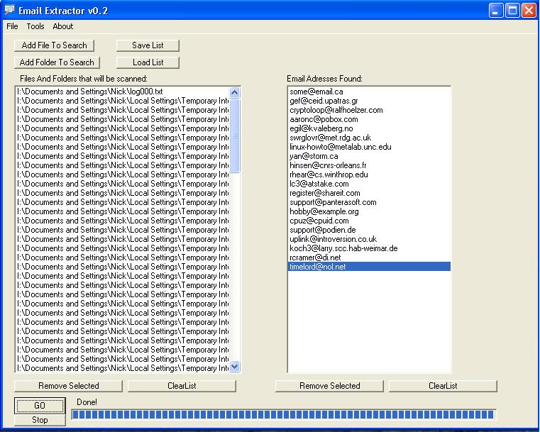



## Email Extractor v0\.2

### Description

The program is an email extractor that sweeps either individual pages or entire directory for email adresses. It picks out and relevant file types which are customisable (txt,html,js etc.) also has many usefull options and feautures a nice error handler script.

In general I've been using PSC a lot and just wanted to give something back (though it probably could do with being more commented). If you like it all i can ask is please vote!

Thanks for looking.
 
### More Info
 

             |
---                |---
**Submitted On**   |2005-06-26 23:47:50
**By**             |[Nick Bullar](https://github.com/Planet-Source-Code/PSCIndex/blob/master/ByAuthor/nick-bullar.md)
**Level**          |Intermediate
**User Rating**    |4.7 (14 globes from 3 users)
**Compatibility**  |VB 5\.0, VB 6\.0
**Category**       |[Internet/ HTML](https://github.com/Planet-Source-Code/PSCIndex/blob/master/ByCategory/internet-html__1-34.md)
**World**          |[Visual Basic](https://github.com/Planet-Source-Code/PSCIndex/blob/master/ByWorld/visual-basic.md)
**Archive File**   |[Email\_Extr1906126272005\.zip](https://github.com/Planet-Source-Code/nick-bullar-email-extractor-v0-2__1-61364/archive/master.zip)

